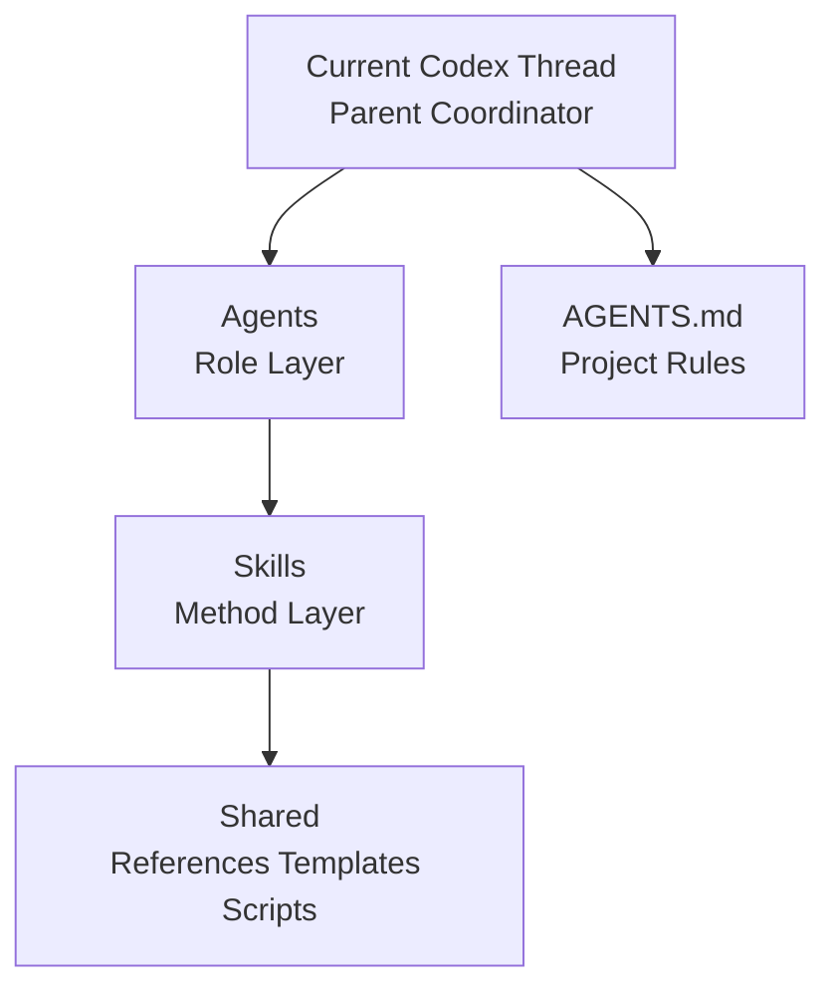
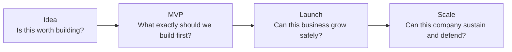

# Architecture Map

See also:

- `../assets/architecture-map.svg`
- `../assets/stage-gates.svg`

## Pack layers

```mermaid
flowchart TB
  P[Current Codex Thread\nParent Coordinator]
  A[Agents\nRole Layer]
  S[Skills\nMethod Layer]
  H[Shared\nReferences Templates Scripts]
  G[AGENTS.md\nProject Rules]

  P --> A
  A --> S
  S --> H
  P --> G
```

## Stage gates

```mermaid
flowchart LR
  I[Idea\nIs this worth building?] --> M[MVP\nWhat exactly should we build first?]
  M --> L[Launch\nCan this business grow safely?]
  L --> C[Scale\nCan this company sustain and defend?]
```
